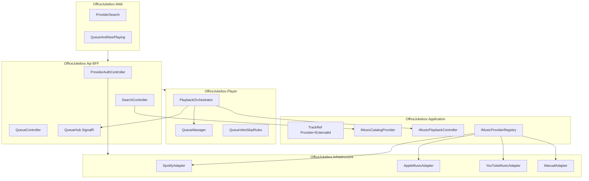

# OfficeJukebox Modernization & Multi-Provider Plan

## Current state

OfficeJukebox is a greenfield .NET 8 + React scaffold with solid queue/veto/skip rule logic, but **no music provider integration or real playback**. Provider-shaped fields already exist on [`TrackPlay`](OfficeJukebox.Domain/Entities/TrackPlay.cs) (`Provider`, `ExternalLink`, `TrackJson`), and [`OfficeJukebox.Infrastructure`](OfficeJukebox.Infrastructure/OfficeJukebox.Infrastructure.csproj) is an empty shell intended for external adapters.

Key gaps blocking multi-provider support:

- Track identity is **name-based** in queue rules (e.g. [`CannotQueueTrackAlreadyPlayingQueueRule`](OfficeJukebox.Application/Queue/Rules/CannotQueueTrackAlreadyPlayingQueueRule.cs)) and **link-based** in scoring — collisions across providers are inevitable
- [`IMusicPlayer`](OfficeJukebox.Application/Abstractions/IMusicPlayer.cs) is a read-only stub; no playback loop exists
- Queue lives in-memory only ([`QueueManager`](OfficeJukebox.Application/Queue/QueueManager.cs)); enqueue does not persist or survive restarts
- Player endpoints are inline in [`Program.cs`](OfficeJukebox.Player/Program.cs); API duplicates DTOs in [`QueueController`](OfficeJukebox.Api/Controllers/QueueController.cs)
- EF ignores artists, duration, artwork ([`JukeboxDbContext`](OfficeJukebox.Infrastructure.Persistence/JukeboxDbContext.cs))
- SignalR hub exists but is not wired to queue/playback events
- [`README.md`](README.md) references a non-existent `src/` folder

## Target architecture



**Playback model (your choice):** one shared office device per active provider, controlled via provider APIs (Spotify Connect, Apple Music authorized device, etc.). The Player process owns the playback loop; the Web UI never plays audio directly.

## Provider capability matrix

Design interfaces around **capabilities**, not a lowest-common-denominator API. Providers declare what they support; the UI and orchestrator adapt.

| Provider | Search | Metadata | Device playback | OAuth | Notes |
| ---------- | -------- | ---------- | ----------------- | ------- | ------- |
| Spotify | Yes | Yes | Yes (Connect) | Yes | Reference implementation |
| Apple Music | Yes | Yes | Limited (MusicKit) | Yes | Requires Apple Developer program |
| YouTube Music | Partial | Yes | Cast/device only | Yes | No official YTM playback API; use YouTube Data API + device cast or mark as search-only initially |
| Manual | No | User-supplied | No | No | Keeps current freeform queue path |

Start with **Spotify as the reference adapter** that proves the full loop (auth → search → queue → device play). Other providers ship behind the same interfaces with capability flags.

---

## Phase 0 — Repository bootstrap (pending Jono120 auth)

**Target:** [https://github.com/Jono120/office-radio-station](https://github.com/Jono120/office-radio-station) (currently empty, no default branch)

**Current blockers:**

- Local workspace at `C:\Users\jlake\projects\office-radio` is **not a git repository**
- GitHub CLI is authenticated as `jlake-tech`, which does **not** have push access to `Jono120/office-radio-station`
- User chose to authenticate as **Jono120** before pushing

### 0.1 Authenticate as Jono120

Run in a terminal (interactive browser flow):

```powershell
gh auth login --hostname github.com --git-protocol https --web
```

When prompted:

1. Choose **GitHub.com**
2. Choose **HTTPS**
3. Choose **Login with a web browser** (or paste a PAT if you have one)
4. Complete login as **Jono120**

Verify:

```powershell
gh auth status
# Should show: Logged in to github.com account Jono120
```

If you need to keep both accounts, add Jono120 as a second account:

```powershell
gh auth login --hostname github.com
gh auth switch --user Jono120
```

### 0.2 Prepare local repository

1. Add root [`.gitignore`](.gitignore) covering .NET (`bin/`, `obj/`, `*.user`), Node (`node_modules/`, `dist/`), SQLite DB files, and `.env`
2. Copy this plan to [`Docs/multi-provider-modernization-plan.md`](Docs/multi-provider-modernization-plan.md)
3. Fix [`README.md`](README.md) path references (remove erroneous `src/` prefix) as part of initial commit

### 0.3 Initial commit and push

```powershell
cd C:\Users\jlake\projects\office-radio
git init
git add .
git commit -m "$(@'
noissue: feat(repo): add OfficeJukebox greenfield scaffold and modernization plan

Initial commit of .NET 8 queue engine, API BFF, React web scaffold,
and multi-provider modernization plan for shared-device playback.
'@)"
git branch -M main
git remote add origin https://github.com/Jono120/office-radio-station.git
git push -u origin main
```

**Commit scope (confirmed):** full codebase + modernization plan in `Docs/`

**Files excluded via .gitignore:** `bin/`, `obj/`, `node_modules/`, build artifacts, local SQLite DB

### 0.4 Post-push verification

```powershell
gh repo view Jono120/office-radio-station
git log -1 --oneline
```

---

## Phase 1 — Foundation fixes (structural modernization)

**Goal:** Make the existing codebase correct, durable, and ready for provider plugins without changing user-facing behavior yet.

### 1.1 Introduce canonical track identity

Add a `TrackRef` value object in [`OfficeJukebox.Domain`](OfficeJukebox.Domain):

```csharp
public readonly record struct TrackRef(string Provider, string ExternalId);
```

- Add `ExternalId` to `TrackPlay` and `TrackScore` (migration)
- Keep `ExternalLink` as a display/deep-link URI, separate from identity
- Update queue rules and [`TrackScoreService`](OfficeJukebox.Application/Scoring/TrackScoreService.cs) to compare `TrackRef` instead of name/link
- Add `ITrackIdentityComparer` in Application for shared logic

### 1.2 Fix persistence gaps

- Persist queue items to SQLite on enqueue (new `QueuedTrack` state or `TrackPlay` with `StartedAt = null` + status enum)
- On Player startup, reload pending queue from DB into `QueueManager`
- Map full track metadata in EF: artists (JSON column or join table), duration, artwork URL
- Serialize `Track` to `TrackJson` on write; deserialize on read (single source of truth)

### 1.3 Restructure Player host

- Extract inline minimal API routes from [`OfficeJukebox.Player/Program.cs`](OfficeJukebox.Player/Program.cs) into controllers or endpoint classes
- Introduce application services: `EnqueueTrackCommandHandler`, `GetQueueQueryHandler` (plain classes + DI, no MediatR unless you want it)
- Share API contracts via a small `OfficeJukebox.Contracts` project (or OpenAPI-generated TS client for Web) to eliminate duplicate request DTOs

### 1.4 Wire real-time updates

- Add `IQueueNotifier` abstraction in Application
- Implement SignalR bridge in Api: Player posts events or Api subscribes to a shared channel
- Emit events: `QueueChanged`, `NowPlayingChanged`, `PlaybackProgress`

### 1.5 Housekeeping

- Fix [`README.md`](README.md) paths (remove erroneous `src/` references)
- Update [`Docs/architecture.md`](Docs/architecture.md) with provider layer diagram
- Add `appsettings` sections for `MusicProviders` in [`appsettings.Development.json.example`](appsettings.Development.json.example)

---

## Phase 2 — Provider abstraction layer

**Goal:** Provider-agnostic contracts in Application; implementations in Infrastructure.

### 2.1 Core interfaces (Application layer)

Create under [`OfficeJukebox.Application/Abstractions/Music`](OfficeJukebox.Application/Abstractions):

```csharp
public interface IMusicProvider
{
    string ProviderId { get; }           // "spotify", "apple-music", "youtube"
    ProviderCapabilities Capabilities { get; }
}

public interface IMusicCatalogProvider : IMusicProvider
{
    Task<IReadOnlyList<Track>> SearchAsync(string query, int limit, CancellationToken ct);
    Task<Track> ResolveAsync(TrackRef trackRef, CancellationToken ct);
}

public interface IMusicPlaybackController : IMusicProvider
{
    Task<PlaybackState> GetStateAsync(CancellationToken ct);
    Task PlayAsync(TrackRef trackRef, CancellationToken ct);
    Task PauseAsync(CancellationToken ct);
    Task ResumeAsync(CancellationToken ct);
    Task SkipAsync(CancellationToken ct);
    Task<IReadOnlyList<PlaybackDevice>> ListDevicesAsync(CancellationToken ct);
    Task SetActiveDeviceAsync(string deviceId, CancellationToken ct);
}

public interface IMusicProviderRegistry
{
    IMusicCatalogProvider? GetCatalog(string providerId);
    IMusicPlaybackController? GetPlayback(string providerId);
    IReadOnlyList<ProviderInfo> ListEnabled();
}
```

`ProviderCapabilities` flags: `Search`, `Resolve`, `DevicePlayback`, `RequiresAuth`.

### 2.2 Auth and credential storage

- New entity: `ProviderCredential` (provider, encrypted refresh token, expires_at, scopes)
- OAuth flows live in **Api BFF** only: `GET /api/providers/{id}/auth`, `GET /api/providers/{id}/callback`
- Use `IDataProtection` or OS keychain for token encryption at rest
- Shared office account model (one token per provider, not per user) — matches Connect-style playback

### 2.3 Infrastructure project structure

Populate [`OfficeJukebox.Infrastructure`](OfficeJukebox.Infrastructure) with:

```text
OfficeJukebox.Infrastructure/
  Music/
    MusicProviderRegistry.cs
    ProviderOptions.cs
    Spotify/
      SpotifyCatalogProvider.cs
      SpotifyPlaybackController.cs
      SpotifyAuthService.cs
    AppleMusic/   (stub → Phase 4)
    YouTube/      (stub → Phase 4)
    Manual/
      ManualCatalogProvider.cs   // passthrough for freeform entries
  DependencyInjection.cs
```

Register providers conditionally from config (`MusicProviders:Spotify:Enabled`, etc.).

### 2.4 Enqueue flow change

Replace freeform string enqueue with provider-aware resolution:

1. Client sends `{ user, provider, externalId, reason? }`
2. Player resolves metadata via `IMusicCatalogProvider.ResolveAsync`
3. Rules run against resolved `Track` + `TrackRef`
4. Persist and enqueue

Keep `manual` provider as fallback for admin/testing.

---

## Phase 3 — Playback orchestration (shared device)

**Goal:** Close the loop from queue → provider device → history/scoring.

### 3.1 Expand `IMusicPlayer` → playback service

Replace stub with `IPlaybackOrchestrator`:

- `CurrentlyPlayingTrack`, `PlaybackState`
- `StartAsync()` / background `PlaybackLoopService` (hosted service in Player)
- Loop: if idle and queue non-empty → dequeue → resolve → `IMusicPlaybackController.PlayAsync` → set `StartedAt` → persist → notify
- Poll provider state; on track end → mark complete → trigger scoring → play next
- Handle skip/veto by calling provider `SkipAsync` and re-evaluating queue

### 3.2 Device management

- Config: `MusicProviders:Spotify:PreferredDeviceId` (or auto-select first available Connect device)
- Admin endpoint: `GET /api/playback/devices`, `PUT /api/playback/device`
- Surface device status in Web UI settings panel

### 3.3 Wire veto/skip HTTP endpoints

Expose existing rule logic via Api:

- `POST /api/queue/{id}/veto`
- `POST /api/queue/{id}/skip`
- Connect to `ISkipHelper` and veto rules already registered in [`DependencyInjection.cs`](OfficeJukebox.Application/DependencyInjection.cs)

---

## Phase 4 — Provider implementations (incremental)

Deliver one provider at a time behind the registry. Each adapter gets integration tests with recorded HTTP fixtures (no live API in CI).

### 4.1 Spotify (reference — ship first)

- NuGet: `SpotifyAPI.Web` or direct REST
- Scopes: `user-read-playback-state`, `user-modify-playback-state`, `user-read-currently-playing`
- Implement full `IMusicCatalogProvider` + `IMusicPlaybackController`
- Proves auth, search, queue, Connect playback end-to-end

### 4.2 Apple Music

- MusicKit JWT + user token
- Implement catalog search/resolve; playback where MusicKit device API allows
- Mark unsupported operations via `ProviderCapabilities`

### 4.3 YouTube / YouTube Music

- YouTube Data API v3 for search/metadata
- Playback: initially **search + queue only** (capability flag off for device playback) until a viable cast/device path is chosen
- Document limitation in provider README

### 4.4 Future stubs

- Deezer, Tidal, local file library — register as disabled stubs returning `NotSupported` with clear errors

---

## Phase 5 — Web UI modernization

**Goal:** Replace placeholder [`App.tsx`](OfficeJukebox.Web/src/App.tsx) with a functional jukebox UI.

- Generate TypeScript client from OpenAPI (or shared Contracts package)
- **Search panel:** provider tabs, unified results with provider badge
- **Queue panel:** real-time via SignalR
- **Now playing:** artwork, progress, device name
- **Settings:** provider connect/disconnect, device picker
- Vite proxy to Api in dev ([`vite.config.ts`](OfficeJukebox.Web/vite.config.ts))

---

## Phase 6 — Operational efficiency (optional, post-MVP)

- Docker Compose for Player + Api + Web (single-command office deploy)
- GitHub Actions CI: build, test, forbidden-strings check (referenced in docs but missing)
- Structured logging with correlation IDs across BFF → Player
- Health checks: provider auth validity, device reachability
- Background job for `TrackScoreService` recomputation (replace on-demand only)

---

## Suggested delivery order

1. **Phase 1 — Foundation:** TrackRef and persistence model
2. **Phase 2 — Abstractions:** Provider interfaces and registry
3. **Phase 3 — Playback:** Playback orchestrator in Player
4. **Phase 4.1 — Spotify:** Reference adapter (auth → search → queue → device play)
5. **Phase 5 — Web UI:** Search, queue, and now playing — starts once Spotify lands; can run in parallel with Phase 4.2
6. **Phase 4.2 — Additional providers:** Apple Music adapter, then YouTube Music catalog
7. **Phase 6 — Operations** (optional, post-MVP): Docker Compose, CI, logging, health checks

**Recommended first milestone:** Phases 1–3 + Spotify (4.1) + minimal Web UI (search, queue, now playing). This delivers a working office jukebox on one provider while the architecture supports others.

---

## Key files to create or modify

| Area | Action |
| ------ | -------- |
| [`OfficeJukebox.Domain`](OfficeJukebox.Domain) | Add `TrackRef`, `ProviderCredential`, queue status enum |
| [`OfficeJukebox.Application`](OfficeJukebox.Application) | Provider interfaces, orchestrator, fix rules/scoring identity |
| [`OfficeJukebox.Infrastructure`](OfficeJukebox.Infrastructure) | Provider adapters, registry, DI |
| [`OfficeJukebox.Infrastructure.Persistence`](OfficeJukebox.Infrastructure.Persistence) | Migration for `ExternalId`, full track metadata, credentials table |
| [`OfficeJukebox.Player`](OfficeJukebox.Player) | Playback hosted service, refactor endpoints |
| [`OfficeJukebox.Api`](OfficeJukebox.Api) | Auth callbacks, search, playback, veto/skip controllers |
| [`OfficeJukebox.Web`](OfficeJukebox.Web) | Functional UI + SignalR client |
| [`Docs/architecture.md`](Docs/architecture.md) | Provider layer documentation |

---

## Risks and mitigations

- **YouTube Music has no official third-party playback API** — treat as catalog-only initially; do not block the architecture on it
- **Apple Music device control is more restricted than Spotify** — capability flags prevent UI from offering unsupported actions
- **Single office OAuth token** — document token refresh and re-auth flow in admin settings; alert when token expires
- **Provider API rate limits** — cache search results briefly; debounce search in Web UI
